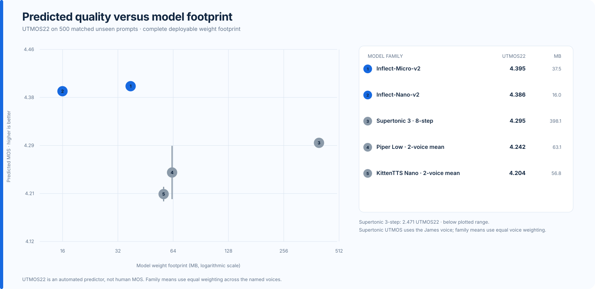
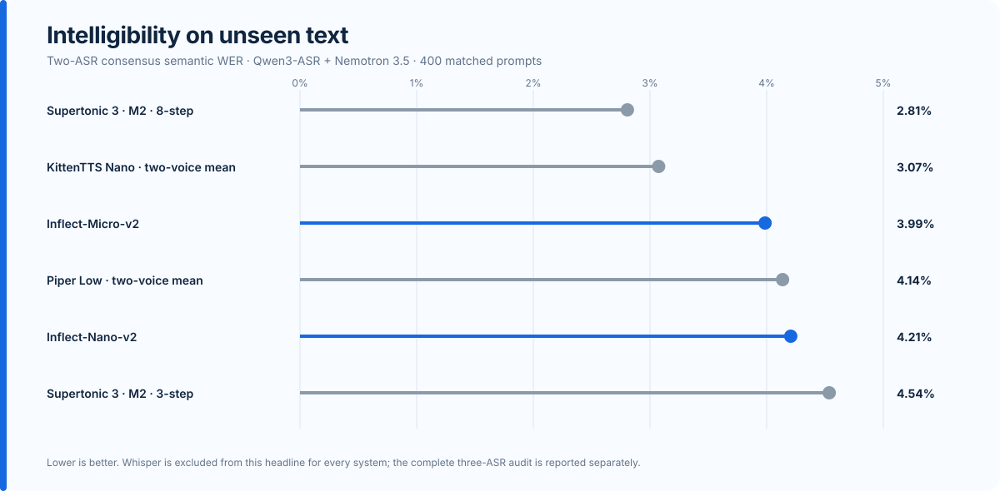
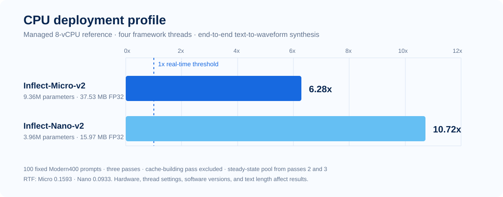
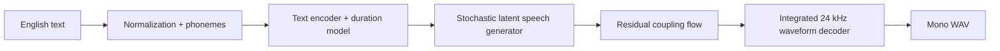

<p align="center">
  
</p>

<h1 align="center">Inflect v2</h1>
<p align="center"><strong>Complete 24 kHz English text-to-waveform models at 3.97M and 9.36M parameters.</strong><br>
Small enough to run locally. Complete enough to need no external vocoder, server model, or inference-time teacher.</p>

<p align="center">
  <a href="https://huggingface.co/owensong/Inflect-Micro-v2"></a>
  <a href="https://huggingface.co/owensong/Inflect-Nano-v2"></a>
  <a href="https://huggingface.co/spaces/owensong/Inflect-v2"></a>
</p>

<p align="center">
  <a href="#listen-first">Listen</a> ·
  <a href="#evaluation">Evaluation</a> ·
  <a href="#run-locally">Run locally</a> ·
  <a href="#architecture">Architecture</a> ·
  <a href="#release-scope">Release scope</a> ·
  <a href="#documentation">Documentation</a>
</p>

---

## Two sizes, one complete runtime

| | **Inflect-Nano-v2** | **Inflect-Micro-v2** |
| --- | ---: | ---: |
| Positioning | Footprint first | Quality first |
| Complete parameters | **3,966,721** | **9,356,513** |
| FP32 weights | **15.97 MB** | **37.53 MB** |
| Output | 24 kHz mono waveform | 24 kHz mono waveform |
| Waveform decoder | Included | Included |
| Voice | One fixed English male voice | One fixed English male voice |
| Public interface | Same Python API and CLI | Same Python API and CLI |

The parameter totals cover the entire local synthesis path: text encoding,
duration prediction, latent synthesis, and the integrated waveform decoder.
Training-only discriminators are not inference parameters, and no second model
is downloaded when speech is generated.

## Listen first

The fastest way to understand the models is the
**[live Inflect v2 playground](https://huggingface.co/spaces/owensong/Inflect-v2)**.
It runs the published checkpoints and supports:

- direct Micro/Nano comparison on identical text and seeds;
- speaking-speed and stochastic-delivery controls;
- punctuation-aware long-text synthesis;
- downloadable 24 kHz WAV output.

Every result is generated from the entered text. The Space does not use
prerecorded fallback audio, reference audio, or a teacher model.

## Evaluation

No single metric describes a TTS system. Inflect reports human preference,
predicted naturalness, multi-ASR intelligibility, model footprint, and runtime
separately.

| Model | Community preference ↑ | UTMOS22 ↑ | Two-ASR semantic WER ↓ | Warm CPU throughput ↑ |
| --- | ---: | ---: | ---: | ---: |
| **Inflect-Micro-v2** | **66.2%** | **4.395** | **3.99%** | **1.58× real time** |
| **Inflect-Nano-v2** | **63.9%** | **4.386** | **4.21%** | **1.59× real time** |

<p align="center">
  
</p>

<p align="center">
  
</p>

<p align="center">
  
</p>

### What the numbers mean

- **Community preference** is anonymous blind pairwise listening with hidden
  model identities and randomized left/right order. It is descriptive evidence,
  not formal MOS.
- **UTMOS22** is a learned quality predictor run on 500 matched unseen prompts
  per voice. It is not human MOS.
- **Semantic WER** is the equal-weight corpus-level mean of Qwen3-ASR and
  Nemotron 3.5 on 400 matched unseen prompts. Whisper large-v3 remains in the
  raw audit but is excluded consistently from the headline after insertion-heavy
  failures on a subset of Supertonic 8-step clips.
- **CPU throughput** is end-to-end warm synthesis on an AMD Ryzen 9 3900X with
  12 threads, 48 identical prompts, three warmups, one isolated process per
  system, and no visible GPU. `1.0×` is real time.

The Hugging Face packages include prompt manifests, hashes, hypotheses,
bootstrap intervals, per-system reports, signal diagnostics, and raw runtime
rows under `evaluation/`.

## Run locally

### Micro: quality-first

```bash
git clone https://huggingface.co/owensong/Inflect-Micro-v2
cd Inflect-Micro-v2
python -m pip install -r requirements.txt
python inference.py \
  --text "A small local model can still sound surprisingly alive." \
  --output out.wav
```

### Nano: footprint-first

```bash
git clone https://huggingface.co/owensong/Inflect-Nano-v2
cd Inflect-Nano-v2
python -m pip install -r requirements.txt
python inference.py \
  --text "This complete model stays under four million parameters." \
  --output out.wav
```

### Python

```python
from inference import InflectTTS

tts = InflectTTS(".", device="cpu")
sample_rate, waveform = tts.synthesize(
    "The model returns a complete waveform.",
    speed=1.0,
    variation=0.667,
    seed=7,
)
tts.save("The same runtime can write a WAV directly.", "sample.wav", seed=7)
```

Long input is split at punctuation-aware boundaries, synthesized chunk by
chunk, and joined with controlled pauses. This bounds memory; it is not one
globally planned long-form pass.

## Architecture

Inflect v2 is a compact VITS-family end-to-end generator with:

- an English normalization and phoneme frontend;
- a transformer text encoder and stochastic duration predictor;
- monotonic alignment and latent-variable speech generation;
- residual coupling flows;
- an integrated alias-reduced neural waveform decoder.



Micro spends its larger budget on hidden and decoder capacity. Nano preserves
the same deployment contract with a narrower model. The release describes the
deployable architecture; private corpus-construction and full optimization
infrastructure are outside the open-weight package.

## Release scope

### Supported

- PyTorch FP32 inference on CPU and CUDA;
- one fixed English male voice per model;
- deterministic seeds, speaking speed, and delivery variation;
- punctuation-aware long-text chunking;
- local Python API, CLI, examples, and complete waveform generation.

### Not claimed

- voice cloning or selectable speakers;
- female or multilingual voices;
- streaming or measured time-to-first-audio;
- validated ONNX, GGUF, Core ML, TFLite, FP16, or integer-quantized exports;
- safety for medical, legal, emergency, or accessibility-critical use.

GGUF is not a natural container for this convolutional VITS-family waveform
model. ONNX and quantized releases will be published only after they preserve
intelligibility and audio quality under matched evaluation.

## Repository map

| Path | Purpose |
| --- | --- |
| [`scripts/`](scripts/) | Evaluation, release, dataset, and research tooling |
| [`inflect/`](inflect/) | Inflect-native research modules |
| [`docs/`](docs/) | Architecture decisions, evaluation, release notes, and publication runbooks |
| [`examples/`](examples/) | Lightweight project examples |
| [`assets/`](assets/) | Release and documentation visuals |

Runnable v2 weights and self-contained inference packages live on Hugging Face,
not in the GitHub repository.

## Documentation

- [Evaluation methodology](docs/INFLECT_V2_EVALUATION_MATRIX_20260721.md)
- [Technical report](docs/INFLECT_V2_TECHNICAL_REPORT.md)
- [Release readiness and limitations](docs/INFLECT_V2_RELEASE_READINESS_20260721.md)
- [Publication runbook](docs/INFLECT_V2_PUBLICATION_RUNBOOK_20260721.md)
- [Technical report outline](docs/INFLECT_V2_TECHNICAL_REPORT_OUTLINE.md)
- [Hero-image generation prompt](docs/INFLECT_V2_HERO_IMAGE_PROMPT.md)
- [Publishing boundaries](PUBLISHING.md)
- [Security policy](SECURITY.md)

## License and contact

Original Inflect code and released weights are Apache-2.0. Bundled third-party
components retain their own notices. Inflect v2 is an **open-weight** release;
the private corpus-generation pipeline and full optimization recipe are not
included.

Designed and developed independently by **Owen Song**.

- Discord: `b111ue`
- Professional inquiries: [owen.aw.song@gmail.com](mailto:owen.aw.song@gmail.com)

## Citation

```bibtex
@software{song2026inflectv2,
  author = {Owen Song},
  title = {Inflect v2: Complete Local Text-to-Waveform TTS at 3.97M and 9.36M Parameters},
  year = {2026},
  url = {https://github.com/owenawsong/Inflect}
}
```
