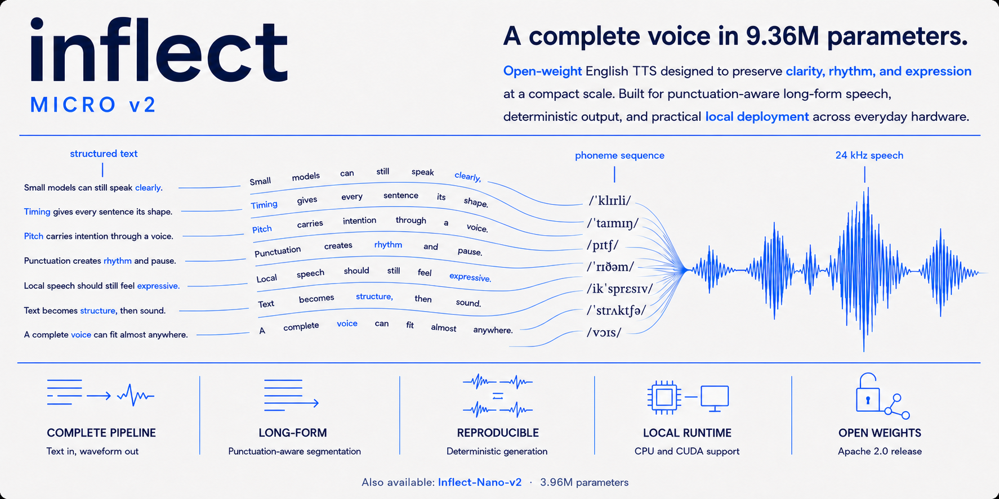
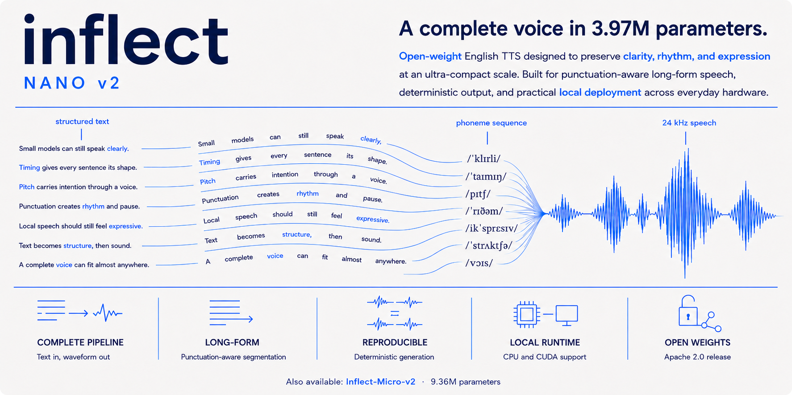

<h1 align="center">Inflect v2</h1>
<p align="center"><strong>Complete 24 kHz English text-to-waveform TTS at 3.96M and 9.36M parameters.</strong><br>
Two local models. One runtime. No external vocoder or hosted inference component.</p>

<p align="center">
  <a href="https://huggingface.co/spaces/owensong/Inflect-v2"></a>
  <a href="https://huggingface.co/owensong/Inflect-Nano-v2"></a>
  <a href="https://huggingface.co/owensong/Inflect-Micro-v2"></a>
  <a href="docs/EVALUATION.md"></a>
  <a href="https://discord.gg/CVJYedvzvp"></a>
</p>

<p align="center">
  <a href="#choose-your-model">Models</a> ·
  <a href="#evaluation">Evaluation</a> ·
  <a href="#run-it">Run it</a> ·
  <a href="#architecture">Architecture</a> ·
  <a href="#documentation">Documentation</a>
</p>

---

## Choose your model

| **Inflect-Micro-v2** | **Inflect-Nano-v2** |
| --- | --- |
| [](https://huggingface.co/owensong/Inflect-Micro-v2) | [](https://huggingface.co/owensong/Inflect-Nano-v2) |
| **Quality first.** The stronger overall release at 9,356,513 complete parameters. | **Footprint first.** The full synthesis path in 3,966,721 complete parameters. |
| [Model and weights](https://huggingface.co/owensong/Inflect-Micro-v2) | [Model and weights](https://huggingface.co/owensong/Inflect-Nano-v2) |

Both packages expose the same Python API and CLI. The counts include text
encoding, duration prediction, latent speech generation, and the integrated
waveform decoder. Training-only discriminators are excluded because they are
not loaded for synthesis.

| | **Micro v2** | **Nano v2** |
| --- | ---: | ---: |
| Complete inference parameters | **9,356,513** | **3,966,721** |
| FP32 weights | **37.53 MB** | **15.97 MB** |
| Output | 24 kHz mono | 24 kHz mono |
| Voice | Fixed English male | Fixed English male |
| Managed CPU throughput | **6.28x real time** | **10.72x real time** |

## Listen first

Use the **[live Inflect v2 playground](https://huggingface.co/spaces/owensong/Inflect-v2)**
to compare Micro and Nano on identical text and seeds. It supports speaking
speed, delivery variation, restrained pitch adjustment, punctuation-aware
long-text generation, and downloadable WAV output.

Every output is synthesized from the entered text by the selected published
checkpoint. The Space does not substitute prerecorded clips.

## Evaluation

Inflect reports human preference, predicted naturalness, multi-ASR
intelligibility, footprint, and runtime separately. They answer different
questions and are not collapsed into a single score.

| Model | Community preference ↑ | UTMOS22 ↑ | Two-ASR semantic WER ↓ | FP32 weights ↓ |
| --- | ---: | ---: | ---: | ---: |
| **Inflect-Micro-v2** | **66.2%** | **4.395** | **3.99%** | 37.53 MB |
| **Inflect-Nano-v2** | **63.9%** | **4.386** | **4.21%** | **15.97 MB** |

<p align="center">
  
</p>

<p align="center">
  
</p>

### CPU deployment profile

<p align="center">
  
</p>

The CPU run used the managed Hugging Face CPU Upgrade reference (8 vCPU,
32 GB RAM), four framework threads, 100 fixed Modern400 prompts, and three
passes. The first cache-building pass was excluded; passes 2 and 3 form the
steady-state pool. Micro measured RTF 0.1593 and Nano RTF 0.0933.

**Metric notes**

- Community preference is anonymous randomized pairwise listening. The rates
  are normalized by model appearances, with ties counting as half a win. It is
  descriptive community evidence, not formal MOS.
- UTMOS22 is a learned quality predictor evaluated on 500 matched unseen
  prompts per voice. It is not human MOS.
- Headline semantic WER is the equal-weight corpus-level mean of Qwen3-ASR and
  Nemotron 3.5 on 400 matched unseen prompts. Whisper large-v3 is retained in
  the raw audit but excluded consistently from the headline due to
  insertion-heavy failures on part of the comparison set.

See the [full evaluation methodology](docs/EVALUATION.md) for scope,
competitor selection, limitations, and reproducibility details. Raw manifests,
hypotheses, intervals, and integrity hashes ship in each Hugging Face model
repository under `evaluation/`.

## Run it

### From this repository

```bash
git clone https://github.com/owenawsong/Inflect.git
cd Inflect
python -m pip install -r requirements.txt

python examples/download_and_speak.py \
  --model micro \
  --text "A complete local voice can fit almost anywhere." \
  --output inflect.wav
```

The first run downloads and caches the selected model from Hugging Face.
Switch `--model micro` to `--model nano` without changing the interface.

Render both models with the same prompt and seed:

```bash
python examples/compare_models.py \
  --text "The same sentence, rendered by both Inflect models." \
  --output-dir comparison
```

### From a model repository

```bash
python -m pip install --upgrade huggingface_hub
hf download owensong/Inflect-Micro-v2 --local-dir Inflect-Micro-v2
cd Inflect-Micro-v2
python -m pip install -r requirements.txt
python inference.py --text "Small models can still speak clearly." --output out.wav
```

```python
from inference import InflectTTS

tts = InflectTTS(".", device="cpu")
sample_rate, waveform = tts.synthesize(
    "The model returns a complete waveform.",
    speed=1.0,
    variation=0.667,
    seed=7,
)
tts.save("The same runtime can write a WAV directly.", "sample.wav", seed=7)
```

Long input is split at punctuation-aware boundaries, synthesized chunk by
chunk, and joined with controlled pauses. This bounds memory; it is not one
globally planned pass or acoustic streaming. See [deployment](docs/DEPLOYMENT.md)
for controls, hardware interpretation, and format support.

## Architecture

Inflect v2 is a compact VITS-family end-to-end generator:


The deployed path includes an English normalization and phoneme frontend,
transformer text encoder, stochastic duration predictor, monotonic alignment,
latent-variable speech generation, residual coupling flows, and an integrated
alias-reduced neural waveform decoder. Micro allocates more capacity to hidden
and decoder width; Nano preserves the same deployment contract with a narrower
network.

Inflect v2 is an **open-weight** release. Deployable weights, inference code,
frontend code, evaluation artifacts, and integrity hashes are public. Private
corpus construction and full optimization infrastructure are not included.

## Scope

**Supported**

- local PyTorch FP32 inference on CPU and CUDA;
- ONNX Runtime inference for published ONNX packages;
- one fixed English male voice per model;
- deterministic seeds, speaking speed, and delivery variation;
- punctuation-aware long-text chunking;
- complete waveform generation through a Python API and CLI.

**Not claimed**

- voice cloning, selectable speakers, female voices, or multilingual speech;
- acoustic streaming or measured time-to-first-audio;
- GGUF, Core ML, TFLite, FP16, or integer-quantized exports;
- use for medical, legal, emergency, or accessibility-critical communication.

## Documentation

| Document | Purpose |
| --- | --- |
| [Deployment guide](docs/DEPLOYMENT.md) | Install, controls, long text, measured CPU behavior, and export status |
| [Evaluation](docs/EVALUATION.md) | Protocols, metrics, comparison policy, and reproducibility |
| [Architecture](docs/ARCHITECTURE.md) | Shipped inference path and parameter accounting |
| [Technical report](docs/INFLECT_V2_TECHNICAL_REPORT.md) | Compact system and evaluation report |
| [Language and fixed-voice adaptation](finetune/README.md) | Prepare data, audit splits, train, resume, evaluate, and export adapted models |
| [Release notes](docs/INFLECT_V2_RELEASE_NOTES_20260721.md) | Frozen v2 capabilities, results, and limitations |
| [Project structure](PROJECT_STRUCTURE.md) | Public code, research code, and release boundaries |
| [Contributing](CONTRIBUTING.md) | Reproducible bug reports and contribution standards |
| [Security](SECURITY.md) | Private vulnerability reporting and responsible use |

## v1

<details>
<summary>Legacy Inflect Nano v1</summary>

[Inflect-Nano-v1](https://huggingface.co/owensong/Inflect-Nano-v1) remains
available for reproducibility and historical comparison. Inflect v2 is the
recommended family for new integrations. v1 is not mixed into the v2 runtime,
documentation, or install path.

</details>

## License and contact

Original Inflect code and released weights are Apache-2.0. Bundled third-party
components retain their own notices. Designed and developed independently by
**Owen Song**.

- Community: [Inflect Discord](https://discord.gg/CVJYedvzvp)
- Discord: `b111ue`
- Professional inquiries: [owen.aw.song@gmail.com](mailto:owen.aw.song@gmail.com)

## Citation

```bibtex
@software{song2026inflectv2,
  author = {Owen Song},
  title = {Inflect v2: Complete Local Text-to-Waveform TTS at 3.96M and 9.36M Parameters},
  year = {2026},
  url = {https://github.com/owenawsong/Inflect}
}
```
